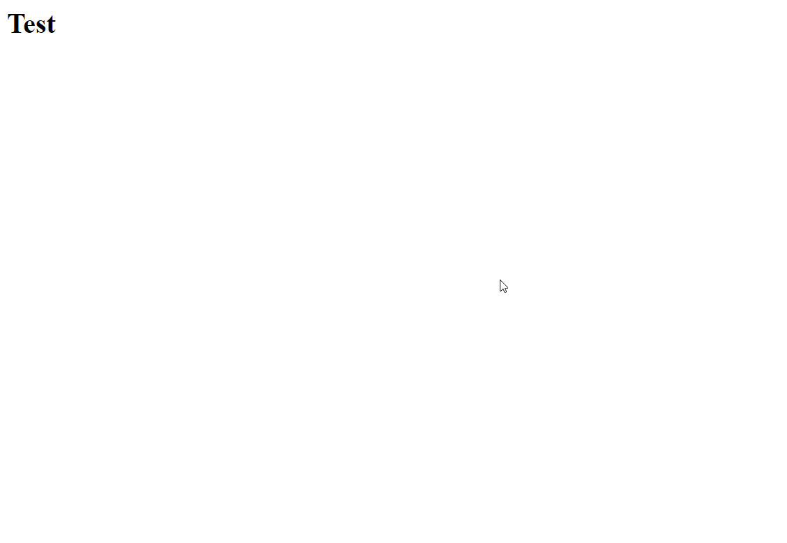

First, open your terminal and create a new virtual environment. 
> Note: You might run into some issues on Linux while running `python`/`pip`. Try running `python3`/`pip3` instead.
> This is because some Linux programs only run on Python v2, so Python v3 sometimes have a different name
```shell
# Create a new virtual environment
python -m venv venv
```
Then, activate the virtual environment. Note that the command for this depends on your OS. 
```shell
# Activate the virtual environment
./venv/Scripts/Activate.ps1 # Windows
source ./venv/bin/activate # Linux/MacOS
```
Now, install Django using `pip`.
```shell
# Install Django
pip install Django
```
Finally, make a new Django project and try running it.
```shell
# Start a new Django project
django-admin startproject testapp
# Open the project folder
cd testapp
# Run your project 
python manage.py runserver
```
Going to [`localhost:8000`](http://localhost:8000), you should be able to see this page<br><br>


Django migrations are a way to propagate changes you make to your models (adding a field, deleting a model, etc.) into your database schema.
```shell
# apply migrations
python manage.py makemigrations
python manage.py migrate
```
Now that you have applied migrations, we will now create  admin-user.
```shell
python manage.py createsuperuser
```

- Enter a username.
- Press enter for the email address.
- Enter any password.
- Enter the password again.
- Type 'y' and press enter to confirm.

<br> 

Now, let's go to the admin site provided by Django and try to login with the admin credentials we just created.<br>
Go to [`localhost:8000/admin/`](http://localhost:8000/admin/) and fill in the required details.<br><br>


Before moving forward, let's have a look at the SQL data generated so far. In order to do so we need to install **SQLite Viewer**.<br>
Now, to view `auth_user`open the `db.sqlite` file.

It's time to create our first Djangoapp. Type the following command in your shell.
```shell
python manage.py startapp myapp
```
This will create a folder in your working directory by the name `myapp`. This folder will contain multiple python files.<br>


Within the same folder we will now create a `urls.py` file and type in the following code.

```python
from django.urls import path
from .views import test

urlpatterns = [
    path('test', test, name='test'),
]
```
<br>


Now, we will create a `View` in our Django app.<br>
Open `myapp/views.py` and type in the following code.

```python
from django.http import HttpResponse
# Create your views here.

def test(request):
    return HttpResponse('<h1>Test</h1>')
```


We also need to configure the `testapp/urls.py` to include the urls of our Django app in our project.<br>
Open `testapp/urls.py` and type in the following:

```python
from django.contrib import admin
from django.urls import include, path


urlpatterns = [
    path('admin/', admin.site.urls),
    path('api/', include("myapp.urls"))
]
```

Update the following line in `settings.py` in testapp folder:
<br>

```python
INSTALLED_APPS = [
   ...
    'myapp',
]

```

Now, if we go to [`localhost:8000/api/test`](http://localhost:8000/api/test), we will be able to see something like the following image.<br>



Now, in `myapp/models.py`, we'll create a model for item. Go to `myapp/models.py` file and copy the following code.

```python
from django.db import models

# Create your models here.

class Item(models.Model):
    
    name = models.CharField(max_length=100)
    description = models.TextField()
    price = models.IntegerField()
```


Now, it's time to use the `Item` model that we created sometime ago. But, in order to so, we first need to apply the model to our database. In your terminal, run the followig commands.

```shell
python manage.py makemigrations
python manage.py migrate
```

If you look at the admin site right now however, you won't be able to see any **Items**. For this, you need to first register the model onto the admin site.

You can do this in `myapp/admin.py`.
```python
from django.contrib import admin
# Import the model 
from .models import Item
# Register it on the admin site
admin.site.register(Item)
```

### So far, so good !!!

Next we'll be installing another important tool for building web APIs, namely "Django Rest Framework".<br>
Go to the terminal and run the following command.
```shell
pip install djangorestframework
```
After installing DRF, we need to go to `settings.py` and add `rest_framework` to the`INSTALLED_APPS` list.<br>

```python
INSTALLED_APPS = [
   ...
    'rest_framework',
]

```

Now, we'll create a serializer for the `Item` model. For that, first we need to make a `serializers.py` file inside the `myapp` folder.<br>

Now, go to the `serializers.py` and add the following code to it.
```python
from rest_framework import serializers
from .models import Item

class ItemSerializer(serializers.ModelSerializer):
    class Meta:
        model = Item
        fields = '__all__'
```


Now we come back to `myapp/views.py` and update the code as follows :

```python
from django.http import HttpResponse
from django.shortcuts import render
from rest_framework.views import APIView
from .models import Item
from .serializers import ItemSerializer
from rest_framework.response import Response
from rest_framework import status


def test(request):
    return HttpResponse('<h1>Test</h1>')


class ItemView(APIView):

    serializer_class = ItemSerializer

    def get(self, request):
        items = Item.objects.all()
        serializer = ItemSerializer(items, many=True)
        return Response(serializer.data)

    def post(self, request, format=None):
        serializer = ItemSerializer(data=request.data)
        if serializer.is_valid():
            serializer.save()
            return Response(serializer.data, status=status.HTTP_201_CREATED)
        return Response(serializer.errors, status=status.HTTP_400_BAD_REQUEST)

     def delete(self, request):
        id = request.GET.get('id')
        item = Item.objects.get(id=id)
        item.delete()
        return Response(status=status.HTTP_204_NO_CONTENT)


```


Now we have to update the routes to actually make our api endpoints for items. For that we update the urls.py 

```python
from django.contrib import admin
from django.urls import include, path
from .views import ItemView, test

urlpatterns = [
    path('test', test, name='test'),
    path('', ItemView.as_view(), name='home'),
]
```


All DONE ! Lets test the apis using postman.


