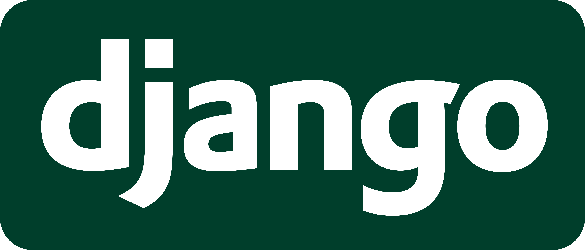

# Welcome to Backend 101 

By Shivesh Gupta and Pranav Prakash

## In this session, you will learn

- **Backend Basics**
  - Need for backend
  - About APIs
  - Data storage in web applications
  - SQL vs NoSQL
  - Request Response Cycle
  - Status Codes
- **Django Framework**
  - Role of sqlite in django
  - Document structure
  - HTML elements
  - Tags
  - Attributes
  - Data representation
  - Tables
  - Links

-  **Creating your own webpages**

## Postman
Postman is a comprehensive API development and testing platform. It simplifies the creation and management of APIs by offering tools for designing, testing, and debugging. Postman streamlines the development process, ensuring efficient communication and integration between different software components.
  
Follow the steps mentioned in [Postman.md](Postman.md) file to use Postman.

## Resources
All the resources for this session are mentioned [here](resources.md).

