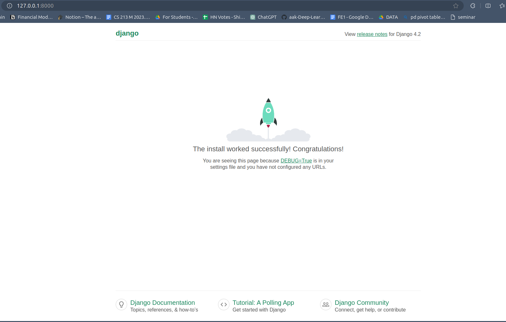

First, open your terminal and create a new virtual environment. 
```shell
# Create a new virtual environment
python -m venv venv
```
Then, activate the virtual environment. Note that the command for this depends on your OS. 
```shell
# Activate the virtual environment
./venv/Scripts/Activate.ps1 # Windows
source ./venv/bin/activate # Linux/MacOS
```
Now, install Django using `pip`.
```shell
# Install Django
pip install Django
```
Finally, make a new Django project and try running it.
```shell
# Start a new Django project
django-admin startproject testapp
# Open the project folder
cd testapp
# Run your project 
python manage.py runserver
```
Going to [localhost:8000](http://localhost:8000), you should be able to see this page<br><br>


Django migrations are a way to propagate changes you make to your models (adding a field, deleting a model, etc.) into your database schema.
```shell
# apply migrations
python manage.py makemigrations
python manage.py migrate
```
Now that you have applied migrations, we will now create  admin-user.
```shell
python manage.py createsuperuser
```

- Enter a username.
- Press enter for the email address.
- Enter any password.
- Enter the password again.
- Type 'y' and press enter to confirm.

<br> 

Now, let's go to the admin site provided by Django and try to login with the admin credentials we just created.<br>
Go to [`localhost:8000/admin/`](https://localhost:8000/admin/) and fill in the required details.<br><br>


Before moving forward, let's have a look at the SQL data generated so far. In order to do so we need to install **SQLite Viewer**.<br>
Now, to view `auth_user`open the `db.sqlite` file.

It's time to create our first webapp in Django. Type the following command in your shell.
```shell
python manage.py startapp myapp
```
This will create a folder in your working directory by the name `myapp`. This folder will contain multiple python files.<br>
Within the same folder we will now create a `url.py` file and type in the following code.
```python
from django.urls import path
from .views import test

urlpatterns = [
    path('test', test, name='test'),
]
```
<br>
Now, in `myapp/models.py`, we'll create a model for item. Go to `myapp/models.py` file and copy the following code.

```python
from django.db import models

# Create your models here.

class Item(models.Model):
    
    name = models.CharField(max_length=100)
    description = models.TextField()
    price = models.IntegerField()
```
pip install djangorestframework


